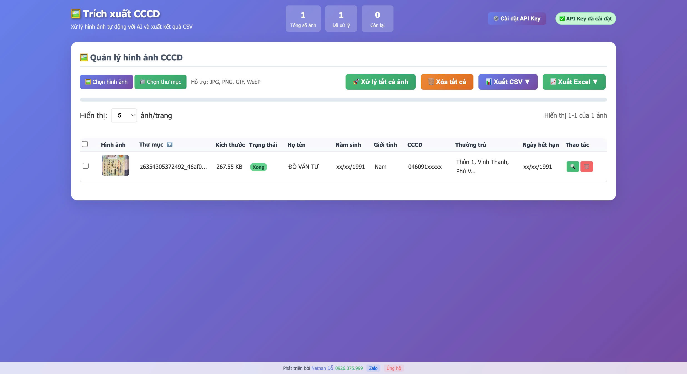

# 🆔 CCCD Information Extractor

[](https://opensource.org/licenses/MIT)
[](https://cancuoccongdan.online)
[](https://openai.com)
[](https://github.com)

> **Công cụ trích xuất thông tin từ căn cước công dân Việt Nam sử dụng AI và OCR**

## 📋 Mục lục

- [✨ Tính năng](#-tính-năng)
- [🚀 Demo trực tuyến](#-demo-trực-tuyến)
- [🧪 Sample Image](#-sample-image)
- [⚡ Cài đặt nhanh](#-cài-đặt-nhanh)
- [🔧 Cài đặt chi tiết](#-cài-đặt-chi-tiết)
- [📖 Hướng dẫn sử dụng](#-hướng-dẫn-sử-dụng)
- [🛠️ Cấu hình API](#️-cấu-hình-api)
- [📱 Responsive Design](#-responsive-design)
- [🔒 Bảo mật](#-bảo-mật)
- [🌐 SEO Optimization](#-seo-optimization)
- [🤝 Đóng góp](#-đóng-góp)
- [📞 Liên hệ](#-liên-hệ)
- [📄 Giấy phép](#-giấy-phép)

## ✨ Tính năng

### 🎯 Tính năng chính
- **🔍 Trích xuất thông tin tự động** từ ảnh CCCD bằng AI
- **📊 Xử lý hàng loạt** nhiều ảnh cùng lúc
- **💾 Lưu trữ cục bộ** dữ liệu trên trình duyệt
- **📤 Xuất Excel** dữ liệu đã trích xuất
- **🖼️ Xem trước ảnh** với giao diện modal đẹp mắt
- **✏️ Chỉnh sửa thông tin** trực tiếp trên giao diện
- **📱 Responsive** hoạt động tốt trên mọi thiết bị

### 🎨 Giao diện
- **🎨 Thiết kế hiện đại** với gradient đẹp mắt
- **🌙 Dark/Light mode** tự động theo hệ thống
- **⚡ Tải nhanh** với tối ưu hóa hiệu suất
- **🎭 Animation mượt mà** cho trải nghiệm tốt

### 🔧 Kỹ thuật
- **🤖 OpenAI GPT-4 Vision** cho độ chính xác cao
- **💾 IndexedDB** lưu trữ dữ liệu offline
- **🔥 Firebase Hosting** triển khai nhanh chóng
- **📱 PWA Ready** có thể cài đặt như app

## 🚀 Demo trực tuyến

**🌐 Truy cập ngay:** [https://cancuoccongdan.online](https://cancuoccongdan.online)

### 📸 Screenshots

<details>
<summary>🖼️ Xem ảnh demo</summary>

- **Trang chủ:** Giao diện chính với upload ảnh
- **Xử lý ảnh:** Quá trình trích xuất thông tin
- **Kết quả:** Hiển thị dữ liệu đã trích xuất
- **Modal xem ảnh:** Xem chi tiết và chỉnh sửa
- **Xuất Excel:** Tải file dữ liệu

</details>

### 🧪 Sample Image

Để test ứng dụng, bạn có thể sử dụng ảnh mẫu có sẵn:

**📁 File mẫu:** `public/sample.jpg`



```bash
# Truy cập ảnh mẫu trực tiếp
https://cancuoccongdan.online/sample.jpg
```

**💡 Cách sử dụng:**
1. Tải ảnh mẫu từ link trên
2. Upload vào ứng dụng
3. Test chức năng trích xuất thông tin
4. So sánh kết quả với dữ liệu thực tế

**⚠️ Lưu ý:** Ảnh mẫu chỉ dành cho mục đích test và demo. Không sử dụng cho mục đích thương mại.

## ⚡ Cài đặt nhanh

### 1️⃣ Clone repository
```bash
git clone https://github.com/nathando91/trich-xuat-can-cuoc-cong-dan-voi-chat-gpt.git
cd trich-xuat-can-cuoc-cong-dan-voi-chat-gpt
```

### 2️⃣ Cài đặt Firebase CLI
```bash
npm install -g firebase-tools
```

### 3️⃣ Đăng nhập Firebase
```bash
firebase login
```

### 4️⃣ Triển khai
```bash
firebase deploy
```

## 🔧 Cài đặt chi tiết

### 📋 Yêu cầu hệ thống
- **Node.js** >= 14.0.0
- **Firebase CLI** >= 9.0.0
- **Trình duyệt** hỗ trợ ES6+ (Chrome 60+, Firefox 55+, Safari 12+)

### 🛠️ Cài đặt từng bước

#### Bước 1: Chuẩn bị môi trường
```bash
# Kiểm tra Node.js
node --version
npm --version

# Cài đặt Firebase CLI
npm install -g firebase-tools
```

#### Bước 2: Clone và cấu hình
```bash
# Clone repository
git clone https://github.com/nathando91/trich-xuat-can-cuoc-cong-dan-voi-chat-gpt.git
cd trich-xuat-can-cuoc-cong-dan-voi-chat-gpt

# Khởi tạo Firebase project (nếu chưa có)
firebase init hosting
```

#### Bước 3: Cấu hình Firebase
```json
// firebase.json
{
  "hosting": {
    "public": "public",
    "ignore": [
      "firebase.json",
      "**/.*",
      "**/node_modules/**"
    ],
    "rewrites": [
      {
        "source": "**",
        "destination": "/index.html"
      }
    ]
  }
}
```

#### Bước 4: Triển khai
```bash
# Triển khai lên Firebase
firebase deploy

# Hoặc triển khai với preview
firebase hosting:channel:deploy preview
```

## 📖 Hướng dẫn sử dụng

### 🎯 Sử dụng cơ bản

#### 1. **Cài đặt API Key**
- Nhấn nút "⚙️ Cài đặt API Key"
- Nhập OpenAI API Key của bạn
- Nhấn "💾 Lưu API Key"

#### 2. **Upload ảnh CCCD**
- Kéo thả ảnh vào vùng upload
- Hoặc nhấn "Chọn ảnh" để browse
- Hỗ trợ nhiều định dạng: JPG, PNG, WEBP

#### 3. **Xử lý ảnh**
- Nhấn "🚀 Xử lý tất cả ảnh"
- Chờ AI phân tích và trích xuất thông tin
- Xem kết quả trong bảng dữ liệu

#### 4. **Chỉnh sửa dữ liệu**
- Nhấn vào ảnh để mở modal xem chi tiết
- Chỉnh sửa thông tin trực tiếp
- Dữ liệu tự động lưu

#### 5. **Xuất dữ liệu**
- Nhấn "📊 Xuất Excel" để tải file
- File Excel chứa tất cả dữ liệu đã xử lý

### 🧪 Test với ảnh mẫu

Để test ứng dụng nhanh chóng, bạn có thể sử dụng ảnh mẫu:

```bash
# Tải ảnh mẫu
wget https://cancuoccongdan.online/sample.jpg

# Hoặc truy cập trực tiếp
curl -O https://cancuoccongdan.online/sample.jpg
```

**📋 Quy trình test:**
1. **Tải ảnh mẫu** từ link trên
2. **Upload vào ứng dụng** 
3. **Xử lý ảnh** và xem kết quả
4. **So sánh** với dữ liệu thực tế
5. **Đánh giá** độ chính xác của AI

**🎯 Mục đích test:**
- Kiểm tra chức năng OCR
- Đánh giá độ chính xác
- Test giao diện người dùng
- Demo cho khách hàng

## 🛠️ Cấu hình API

### 🔑 OpenAI API Key

#### Lấy API Key
1. Truy cập [OpenAI Platform](https://platform.openai.com)
2. Đăng ký/Đăng nhập tài khoản
3. Vào "API Keys" → "Create new secret key"
4. Copy API Key (bắt đầu với `sk-`)

#### Cấu hình trong ứng dụng
```javascript
// Lưu API Key (được mã hóa trong localStorage)
localStorage.setItem('openai_api_key', 'your_api_key_here');

// Sử dụng API Key
const apiKey = localStorage.getItem('openai_api_key');
```

#### Giới hạn và chi phí
- **Rate limit:** 10,000 requests/month (free tier)
- **Chi phí:** ~$0.01-0.02 per image
- **Model:** GPT-4 Vision (recommended)

## 🌐 SEO Optimization

### 🔍 Meta Tags
```html
<!-- Primary Meta Tags -->
<title>Trích xuất CCCD - Công cụ OCR AI miễn phí</title>
<meta name="description" content="Trích xuất thông tin từ căn cước công dân Việt Nam bằng AI. Công cụ OCR miễn phí, chính xác cao, dễ sử dụng.">
<meta name="keywords" content="CCCD, căn cước công dân, trích xuất, OCR, AI, Việt Nam, miễn phí">

<!-- Open Graph / Facebook -->
<meta property="og:type" content="website">
<meta property="og:url" content="https://cancuoccongdan.online/">
<meta property="og:title" content="Trích xuất CCCD - Công cụ OCR AI miễn phí">
<meta property="og:description" content="Trích xuất thông tin từ căn cước công dân Việt Nam bằng AI. Công cụ OCR miễn phí, chính xác cao, dễ sử dụng.">
<meta property="og:image" content="https://cancuoccongdan.online/trich-xuat-can-cuoc-cong-dan.png">

<!-- Twitter -->
<meta property="twitter:card" content="summary_large_image">
<meta property="twitter:url" content="https://cancuoccongdan.online/">
<meta property="twitter:title" content="Trích xuất CCCD - Công cụ OCR AI miễn phí">
<meta property="twitter:description" content="Trích xuất thông tin từ căn cước công dân Việt Nam bằng AI. Công cụ OCR miễn phí, chính xác cao, dễ sử dụng.">
<meta property="twitter:image" content="https://cancuoccongdan.online/trich-xuat-can-cuoc-cong-dan.png">
```

### 🎯 Keywords Strategy
- **Primary:** CCCD, căn cước công dân, trích xuất
- **Secondary:** OCR, AI, Việt Nam, miễn phí
- **Long-tail:** "công cụ trích xuất CCCD", "OCR căn cước công dân"

### 📈 Performance SEO
- **Core Web Vitals:** Optimized for LCP, FID, CLS
- **Page Speed:** < 3s load time
- **Mobile-friendly:** 100% mobile score
- **Accessibility:** WCAG 2.1 AA compliant

## 🤝 Đóng góp

### 🚀 Cách đóng góp
1. **Fork** repository
2. **Tạo branch** mới: `git checkout -b feature/amazing-feature`
3. **Commit** thay đổi: `git commit -m 'Add amazing feature'`
4. **Push** lên branch: `git push origin feature/amazing-feature`
5. **Tạo Pull Request**

### 📝 Guidelines
- **Code style:** Tuân thủ ESLint config
- **Commit message:** Sử dụng conventional commits
- **Testing:** Test trên nhiều trình duyệt
- **Documentation:** Cập nhật README khi cần

### 🐛 Báo lỗi
Sử dụng [GitHub Issues](https://github.com/nathando91/trich-xuat-can-cuoc-cong-dan-voi-chat-gpt/issues) với template:
```markdown
**Mô tả lỗi**
Mô tả rõ ràng về lỗi gặp phải.

**Các bước tái hiện**
1. Vào trang '...'
2. Click vào '...'
3. Scroll xuống '...'
4. Thấy lỗi

**Kết quả mong đợi**
Mô tả kết quả mong đợi.

**Screenshots**
Nếu có thể, thêm screenshots.

**Thông tin hệ thống:**
- OS: [e.g. Windows 10]
- Browser: [e.g. Chrome 91]
- Version: [e.g. 1.0.0]
```

## 📞 Liên hệ

### 👨‍💻 Developer
- **Tên:** Nathan Đỗ
- **Phone:** [0926.375.999](tel:0926375999)
- **Zalo:** [0926.375.999](https://zalo.me/84926375999)
- **Email:** [doduytu@gmail.com](mailto:doduytu@gmail.com)

### 💬 Hỗ trợ
- **GitHub Issues:** [Tạo issue mới](https://github.com/nathando91/trich-xuat-can-cuoc-cong-dan-voi-chat-gpt/issues)
- **Zalo:** Liên hệ trực tiếp qua Zalo
- **Email:** Gửi email hỗ trợ

### 🌟 Ủng hộ
Nếu dự án hữu ích, bạn có thể:
- ⭐ **Star** repository
- 🍴 **Fork** và đóng góp
- 💰 **Donate** qua Zalo
- 📢 **Share** với bạn bè

## 📄 Giấy phép

Dự án này được phân phối dưới giấy phép MIT. Xem file [LICENSE](LICENSE) để biết thêm chi tiết.

```
MIT License

Copyright (c) 2024 Nathan Đỗ

Permission is hereby granted, free of charge, to any person obtaining a copy
of this software and associated documentation files (the "Software"), to deal
in the Software without restriction, including without limitation the rights
to use, copy, modify, merge, publish, distribute, sublicense, and/or sell
copies of the Software, and to permit persons to whom the Software is
furnished to do so, subject to the following conditions:

The above copyright notice and this permission notice shall be included in all
copies or substantial portions of the Software.

THE SOFTWARE IS PROVIDED "AS IS", WITHOUT WARRANTY OF ANY KIND, EXPRESS OR
IMPLIED, INCLUDING BUT NOT LIMITED TO THE WARRANTIES OF MERCHANTABILITY,
FITNESS FOR A PARTICULAR PURPOSE AND NONINFRINGEMENT. IN NO EVENT SHALL THE
AUTHORS OR COPYRIGHT HOLDERS BE LIABLE FOR ANY CLAIM, DAMAGES OR OTHER
LIABILITY, WHETHER IN AN ACTION OF CONTRACT, TORT OR OTHERWISE, ARISING FROM,
OUT OF OR IN CONNECTION WITH THE SOFTWARE OR THE USE OR OTHER DEALINGS IN THE
SOFTWARE.
```

---

<div align="center">

**⭐ Nếu dự án hữu ích, hãy cho một star! ⭐**

[](https://github.com/nathando91/trich-xuat-can-cuoc-cong-dan-voi-chat-gpt/stargazers)
[](https://github.com/nathando91/trich-xuat-can-cuoc-cong-dan-voi-chat-gpt/network)
[](https://github.com/nathando91/trich-xuat-can-cuoc-cong-dan-voi-chat-gpt/watchers)

**🚀 Made with ❤️ by [Nathan Đỗ](https://zalo.me/84926375999)**

</div>
# trich-xuat-can-cuoc-cong-dan-voi-chat-gpt
